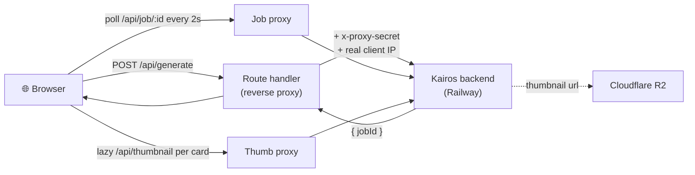

<div align="center">

# 🎯 Kairos — Frontend

### A live, product-grade dashboard for the AI crypto-content engine

Watch the pipeline run in real time, browse platform-native idea previews with AI thumbnails, and open any idea for its full script, hooks & hashtags.

[](https://nextjs.org)
[](https://react.dev)
[](https://www.typescriptlang.org)
[](https://tailwindcss.com)
[](https://vercel.com)

**Backend repo →** [`kairosbackend`](https://github.com/Iglxkardam/kairosbackend)

</div>

---

## ✨ Highlights

- 📊 **Live run dashboard** — sources scanned, viral patterns, narratives, ideas, a research feed, pattern analysis, an animated run-status gauge, and real token/cost usage — all driven by the *current* generation.
- 🎬 **Platform-native previews** — Instagram reels, YouTube cards and X threads rendered like the real thing, with **AI thumbnails** of the creator's face.
- 📄 **Per-idea detail pages** — click any idea for a scene-by-scene script, caption, hashtags and the real source it was grounded in (with copy buttons).
- 🕑 **History** — every run is saved locally with a unique id; reopen any past run's full board.
- 🔒 **Reverse proxy** — the browser only ever talks to same-origin `/api/*`; the backend URL and shared secret never reach the client.
- 🌗 Day / night themes, mobile-friendly, smooth minimalist motion.

---

## 🔁 How a request flows



> `BACKEND_URL` + `PROXY_SECRET` live only in server-side env. The client can't see or call the backend directly — every call is same-origin and the proxy injects the secret.

---

## 🚀 Run locally

```bash
pnpm install
cp .env.example .env.local   # then fill in the values below
pnpm dev                     # http://localhost:3000
```

`.env.local`:

```bash
BACKEND_URL=http://localhost:8080   # the kairos backend
PROXY_SECRET=                        # must match the backend's PROXY_SECRET
```

> Run the [backend](https://github.com/Iglxkardam/kairosbackend) alongside it. Then hit **Start generating** and watch the pipeline run.

### Verify

```bash
pnpm build      # production build
pnpm lint
```

---

## ☁️ Deploy to Vercel

1. **Add New → Project** → import this repo. Vercel auto-detects Next.js (zero config).
2. Add Environment Variables:
   - `BACKEND_URL` → your Railway backend URL
   - `PROXY_SECRET` → same value as the backend
3. Deploy. The reverse-proxy route handlers keep the backend private.

---

## 📁 Structure

```
src/
  app/
    page.tsx                 dashboard (server: reads client IP for the greeting)
    history/                 run list + run detail pages
    idea/[id]/               per-idea script / hashtags / thumbnail page
    api/                     reverse proxy → backend (generate · job · thumbnail)
  components/
    dashboard.tsx            orchestrates the live run
    run-board.tsx            shared "done" view (dashboard + history)
    results.tsx + preview/   reel · youtube · x-thread cards
    idea-detail.tsx          full idea breakdown
    research-feed · pattern-analysis · run-status · agent-usage
  lib/
    use-run.ts               run lifecycle + job polling (reload-safe)
    history.ts               localStorage history (capped, quota-safe)
    usage-store.ts           live token/cost accounting
```

---

<div align="center">
<sub>Built for The Sujal Show — AI Engineer assignment.</sub>
</div>
